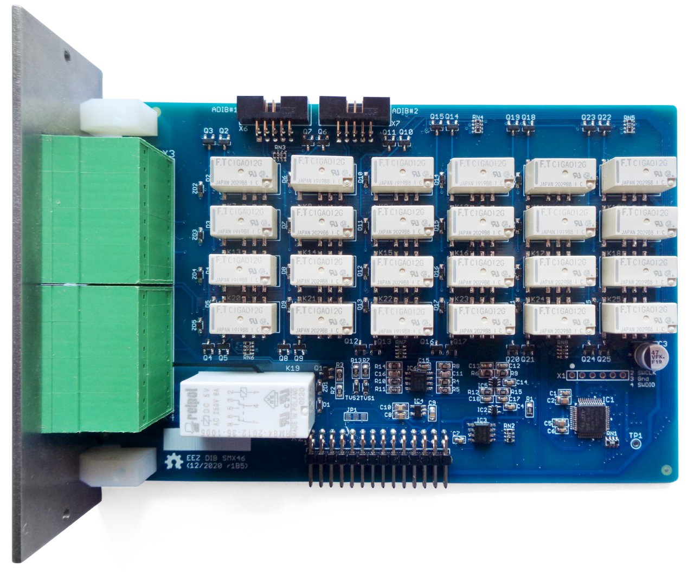

The EEZ DIB SMX46 module features programmable 4 x 6 switch matrix,  dual analog outputs and one power relay. 

### Feature list

* On-board STM32F030C6T6 MCU 
* 2 x 16-pin dual row 3.81 mm connectors
* 2 x ADIB connectors (10-pin 2 mm)
* 4 x 6 switch matrix (24 two-wire crosspoints), max. 2 A 
* 1 x power relay, max. 8 A / 230 Vac
* 2 x analog output 0 - 10 V, 10 mV set resolution (12-bit)
* On-board +3.3 V LDO
* Firmware download via UART
* Optional SWD for debugging
* I2C EEPROM for storing board specific parameters
* Dimensions: 146 x 95 mm, 2-layer PCB

### Firmware repository

https://github.com/eez-open/dib-smx46-fw

### r1B5 prototype

