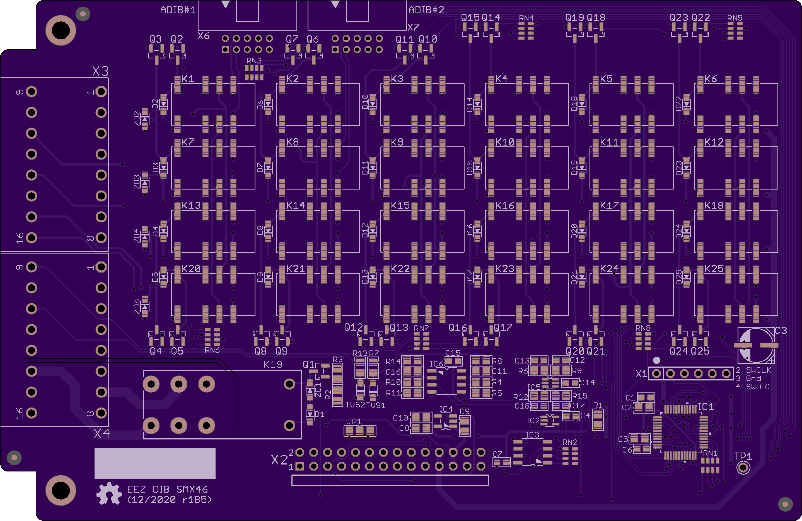

The EEZ DIB SMX46 module features programmable 4 x 6 switch matrix. 

### Feature list

* 2 x 16-pin dual row 3.51 mm connectors
* 24 x SPDT relays, max. 2 A 
* 1 x power relay, max. 8 A / 230 Vac
* 2 x DAC output 0 - 10 V
* On-board +3.3 V LDO
* STM32F030 MCU
* Firmware download via UART
* Optional SWD for debugging
* I2C EEPROM for storing board specific parameters
* Dimensions: 146 x 95 mm, 2-layer PCB

### PCB r1B1 prototype

